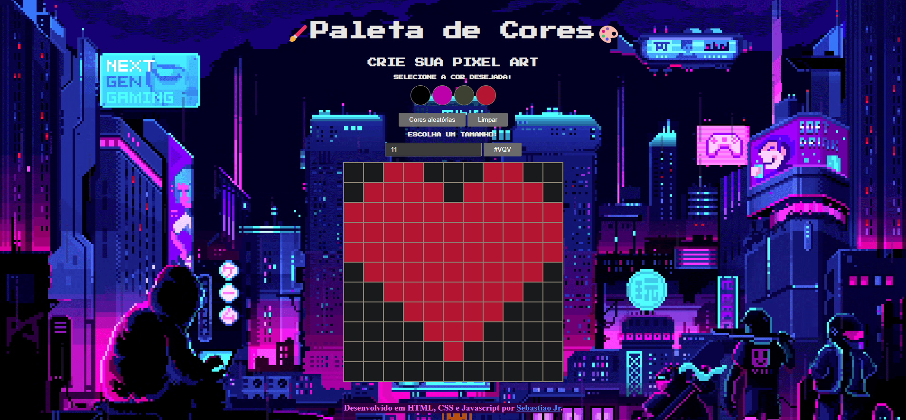

  <h1>🎨 Project Pixels Art 🖌️</h1>

My third project produced while I was studying JS at Trybe Programming School.

In this project, I implemented a pixel art editor where the user can choose a color from a color palette and can paint whatever he wants on a whiteboard.

What was used to develop:
HTML, CSS, DOM, Events in JavaScript, Manipulate objects in localStorage

## 👨‍💻 Language and Technologies used

  
<strong>🏗 Project structure</strong>
 

Built files:
`index.html`
`style.css`
`script.js`

Obs.: The image in the background isn't mine.

  
<strong>🔎 Linter</strong>
 

### 🧠 ESLint e Stylelint

To ensure code quality, the `ESLint` and `Stylelint` linters were used in this project.
So the code will be available with good development practices, being more readable and easy to maintain!

ESLint is a tool for identifying and reporting patterns found in ECMAScript/JavaScript code. In many ways it is similar to JSLint and JSHint with a few exceptions:

* ESLint uses Espree for JavaScript parsing.
* ESLint uses an AST to evaluate patterns in code.
* ESLint is completely 'pluggable', each of the rules is a plugin and you can add […]

  
<strong>🗣 Feedbacks</strong>
 
  
_Give me feedbacks, I'm open to new ideas_ 😉

## 💻 Home Page

<!-- 

  

 -->
